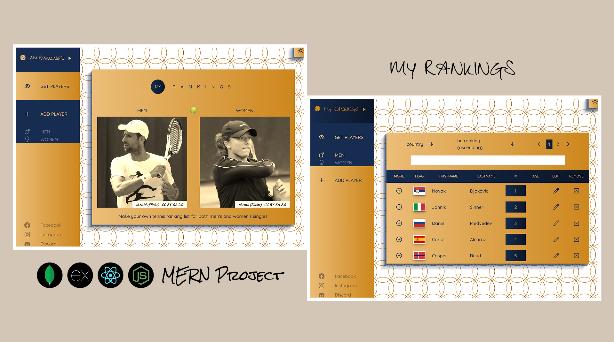

# MyRankings (MERN Project)

## Table of contents

- [Preview](#preview)
- [About](#about)
  - [Missing](#missing)
  - [Frontend](#frontend)
  - [Backend](#backend)
- [Credits](#credits)

## Preview

  

## About

This project is designed to showcase full-stack development skills, encompassing both frontend and backend work. It features a website where users can create their own tennis ranking lists for both men's and women's singles.

Key Features:
* Real-Time Updates: Users can see changes immediately thanks to asynchronous functions, eliminating the need to reload the page.
* Responsive Design: The website is designed to be responsive, ensuring an optimal user experience across all devices.
* Smooth Transitions: Elements include transitions (e.g., when hovering) to add flexibility and enhance the user experience.
* Theme Toggle: Users can switch between light and dark themes, a common feature in modern websites.
* Accessibility: The website includes accessibility features to cater to a wide range of user needs.

### Tools/Requirements:
- MongoDB ( Database)
- Express + Node.js ( Backend / Server)
- React ( Frontend)
- Node.js ( Runtime for Backend)
- Accessibility
- Responsiveness (Viewport size, REM / EM)
- Transitions
- Light / Dark Themes
- RESTful API
- SPA (Single-page application)
- Reusable Code

### Missing

Currently, the project works with a single database created using MongoDB. To allow each user to have their own database, multiple instances and user registration would be required. As this project is primarily for demonstrating skills, these features may be added in the future or included in future projects.

### Frontend

The visual aspect of this project is designed to be simple and user-friendly, with a focus on contrast to distinguish the boundaries of elements and highlight important features. Icons are used in mobile views or when space is limited to ensure clarity. Accessibility features are included to support users who rely on auditory senses, with plans to enhance these features in the future.
The frontend is created using React (a JavaScript framework) with Vite as the development server. The process begins with building the website skeleton using semantic HTML, followed by styling with Sass. Since browsers cannot directly interpret Sass, Vite handles the conversion to standard CSS.
Once the structure (HTML), styling (CSS), and logic (JavaScript, specifically JSX) are in place, data needs to be fetched from the backend. For this, the Axios library is used.

#### Color Balance (Foreground and Background) - Important for Users

Good readability is crucial for retaining users, which requires proper contrast between foreground (text color) and background. Tools like the 'Coolors' website can help check the color balance.
* [Link](https://coolors.co/contrast-checker/112a46-acc8e5)

#### React Code Organization - Important for Developers

One of the main advantages of frameworks like React or Angular is the ability to split code into smaller, logical units, making it easier to manage and reuse. For instance, a dropdown component can be created to avoid redundancy across the project. By passing different content through props from the parent component, the same dropdown component can be reused in multiple places.
Styling organization is also important. The BEM (Block, Element, Modifier) naming convention helps developers focus on elements as blocks with related elements and variations. For example, a form can be treated as a block with elements like fields, labels, and inputs, each with different modifiers for various types of forms.

```jsx
  <header className={`filter--rankings ${theme === 'light' ? 'light' : 'dark'}`}>
    <div className='filter--rankings__wrapper'>
      <h4 className='sr-only'>Filter for rankings</h4>
      <div className='filter--rankings__item'>
        <Dropdown
          label='country'
          list={playersCountries}
          setPageCurr={setPageCurr}
          playerGender={playerGender}
        />
      </div>
      <div className='filter--rankings__item'>
        <Dropdown
          label='sort'
          list={sortingTypes}
          setPageCurr={setPageCurr}
          playerGender={playerGender}
        />
      </div>
    </div>
  </header>
```

```jsx
  const Dropdown = (
      {
          label, // prop
          list, // prop
          setPageCurr, // prop
          playerGender // prop
      }
  ) => { ... }
```

```scss
  .form {
      &--player {
          &__wrapper {
              ...
          }
          &__fieldsets {
              ...
          }
          &__field {
              ...
          }
          &__button {
              &--clickable {
                  ...
              }
              &--disable {
                  ...
              }
          }
      }
      &--search {
          ...
      }
  }
```

#### SAP (Single Application pages)

Modern websites often strive to be Single Page Applications (SPAs), offering advantages like dynamic content loading without page refreshes, better user experience, and faster interactions. To achieve this, routing is used, and the 'react-router-dom' npm package is a popular choice.
* [Link - Installation](https://www.npmjs.com/package/react-router-dom)
* [Link - Documentation](https://reactrouter.com/en/main)

```jsx
  import {
    createBrowserRouter,
    Route,
    createRoutesFromElements,
    RouterProvider,
    Navigate,
  } from 'react-router-dom'

  const router = createBrowserRouter(
    createRoutesFromElements(
      <Route path='/' element={<PageLayout />} >
        <Route index element={<Home />} />
        <Route path='players' element={<PlayersLayout />} >
          <Route index element={<Navigate to="men" replace />} />
          <Route path='men' element={<PlayerListPage playerGender={"men"} />} />
          <Route path='women' element={<PlayerListPage playerGender={"women"} />} />        
          <Route path='men/new' element={<PlayerAddPage playerGender={"men"} />} />
          <Route path='women/new' element={<PlayerAddPage playerGender={"women"} />} />
          <Route path='men/:id/:slug' element={<PlayerDetailPage playerGender={"men"} />} />
          <Route path='women/:id/:slug' element={<PlayerDetailPage playerGender={"women"} />} />
          <Route path='men/:id/:slug/edit' element={<PlayerEditPage playerGender={"men"} />} />
          <Route path='women/:id/:slug/edit' element={<PlayerEditPage playerGender={"women"} />} />
        </Route>
      </Route>
    )
  )

  const App = () => {    
    return (
      <RouterProvider router={router} />
    )
  }
```

#### Accessibility - Important for Users that Rely on Auditory Senses

Each section or article of the page should have its own heading to serve as an introduction. While these headings might affect the visual design, they are essential for users relying on screen readers. These headings can be visually hidden but remain accessible to screen readers. One widely accepted method for this can be found at the link below:
* [Link](https://gist.github.com/luxplanjay/6f6936b1bba7afe006fa9317b07b6045)
  
### Backend

While the frontend focuses on the visual aspects, the backend handles what goes on "behind the scenes." This includes the server and the database, which manage data and application logic.
In this project, the server is created using Node.js, a JavaScript runtime environment. For the database, we use MongoDB, a NoSQL database, with MongoDB Atlas providing cloud-based data storage. To make a connection between Nodejs and MongoDb, we can use Mongoose library. In the backend, we define our schema and create models based on it. We also set up routes to handle various API requests. On the frontend, we use Axios to connect to these backend routes, enabling communication between the frontend and the backend.

```jsx
  const players_fetch = async () => {
    const players_filtered = `${import.meta.env.VITE_SERVER}/players/${playerGender}?${searchParams}`
    await axios
      .get(players_filtered)
      .then((res) => {
          ...
      })
      .catch((error) => {
          console.log(error)
      })
  }
```

#### REST API

The API created for this project is a RESTful API, which provides CRUD (Create, Read, Update, Delete) operations to manipulate endpoints. The RESTful approach allows for versatile use of HTTP methods. For instance, the GET method can be used both to retrieve a list of items and to fetch a single item.
In this project:

* GET Method: Used to retrieve all filtered players or a single player. To distinguish routes, a dynamic path parameter (route parameter) is used for single player retrieval. This parameter, often the unique id from MongoDB, ensures secure and precise access to individual documents.

```js
  // all (filtered)
  router.get('/men', getUsers);
  router.get('/women', getUsers);

  // a single player
  router.get('/men/:id/:slug', getUser)
  router.get('/women/:id/:slug', getUser)
```

## Credits

### Images

- Player images
  * author: si.robi
  * website: [Flickr](https://www.flickr.com/)
  * [URL](https://www.flickr.com/people/16732597@N07)
  * Note: photos can be also find at the WikimediaCommons
    * e.g. [Iga Swiatek](https://commons.wikimedia.org/wiki/File:Swiatek_RG19_(1)_(48199020336).jpg)
- Tennis ball
  * author: pongpongching
  *   * website: [Freepik](https://www.freepik.com/)
  * [URL](https://www.freepik.com/free-vector/tennis-championship-poster-template_13986890.htm)
- Flags
  * author: verluk
  * website: [Flaticon](https://www.flaticon.com/)
  * [URL](https://www.flaticon.com/packs/all-national-flags-of-the-world-very-high-quality-14009628)

### Icons

- Lucide React
  * [URL](https://lucide.dev/guide/packages/lucide-react)
  * icons used:
    * Eye, XSquare, Pencil, PlusCircle, Plus, ChevronRight, ChevronLeft, ArrowDown
- React Icons
  * [URL](https://react-icons.github.io/react-icons/)
  * icons used: FaFacebook, FaInstagram, FaDiscord, PiGenderFemaleBold, PiGenderMaleBold, GiTennisBall, MdPlayArrow, MdEmojiEvents, IoMoon, MdOutlineWbSunny
  
